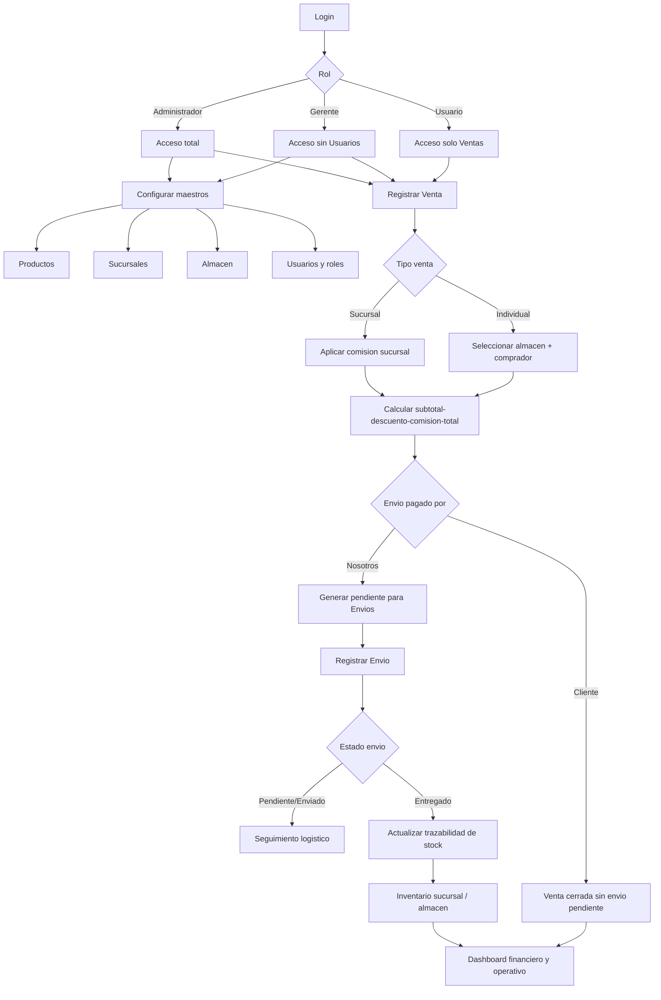

# El Tarot como Guia - Panel Operativo

Aplicacion web (React + TypeScript + Supabase) para centralizar operacion comercial:
ventas, envios, inventario, sucursales, almacenes, usuarios y analitica financiera.

## Objetivo del sistema

- Centralizar datos del negocio en un solo panel.
- Trazar cada producto desde almacen hasta venta y entrega.
- Automatizar calculos de comisiones, descuentos, costos y ganancia neta.
- Operar por roles con permisos diferenciados.

## Que hace cada modulo

### 1) Dashboard

- Consolida operaciones de ventas y envios.
- Permite filtrar por rango de fechas, canal, sucursal y producto.
- Muestra KPIs: operaciones, unidades, ingreso bruto, comisiones/descuentos, costos de envio, ganancia neta.
- Incluye comparativos de periodo, top productos, top sucursales y detalle diario.

### 2) Ventas

- Registra ventas de tipo:
  - `SUCURSAL`
  - `INDIVIDUAL`
- Soporta multiproducto por venta.
- Calcula automaticamente:
  - subtotal
  - comision (segun sucursal)
  - descuento global (%)
  - total neto de venta
- En ventas individuales:
  - origen en almacen obligatorio
  - datos de comprador (documento, nombre, pais, ciudad)
  - define quien paga envio (`CLIENTE` o `NOSOTROS`)
  - si paga `NOSOTROS`, deja pendiente para modulo de envios.

### 3) Envios

- Registra envios de tipo:
  - `SUCURSAL`
  - `INDIVIDUAL`
- Soporta multiproducto por envio.
- En individuales, toma destinatario desde ventas pendientes de envio.
- Gestiona estados de envio:
  - `PENDIENTE`
  - `ENVIADO`
  - `ENTREGADO`
- Al marcar `ENTREGADO`, ejecuta trazabilidad de inventario con triggers.

### 4) Productos

- Gestion de catalogo: nombre, descripcion, codigo de barra/ISBN, precio, estado.
- CRUD completo con validaciones.

### 5) Sucursales

- Gestion de sedes comerciales.
- Incluye datos fiscales y operativos:
  - NIT
  - RUT
  - PDF de RUT (storage bucket)
  - porcentaje de comision
  - ubicacion y contacto.

### 6) Almacen

- Gestion de bodegas origen para ventas/envios.
- Campos de costo operativo (es propio / arriendo).
- Inventario por almacen y movimientos de almacen.
- Soporta localidad (barrio/municipio unificado).

### 7) Inventario

- Inventario por sucursal (existencia y minimo).
- Ajustes manuales con registro de movimientos.
- Alertas de bajo stock.
- Integracion con envios y ventas para trazabilidad.

### 8) Usuarios

- Gestion de identidad y roles en Supabase (`auth` + esquema `identidad`).
- Creacion de usuarios desde frontend con vinculacion automatica.
- Edicion de perfil y cambio de password.
- Asignacion de rol y eliminacion controlada.

## Roles y permisos

- `Administrador`: acceso total a todos los modulos.
- `Gerente`: acceso total excepto modulo de usuarios.
- `Usuario`: acceso solo a ventas.

Permisos implementados via RLS + funciones RPC en base de datos.

## Arquitectura funcional

```text
Frontend (React)
  -> Auth (Supabase Auth)
  -> RPCs y tablas por esquema:
     - identidad.*
     - catalogo.*
     - operaciones.*
     - ventas.*
  -> Dashboard consolidado (ventas + envios)
```

## Flujograma operativo (negocio)



## Estructura de carpetas

```text
src/
  APP/         shell, rutas, navegacion y control de acceso
  AUTH/        login/sesion
  DASHBOARD/   analitica y KPIs
  SALES/       ventas y reglas de negocio comercial
  SHIPMENTS/   envios y estados logisticos
  PRODUCTS/    catalogo
  BRANCHES/    sucursales
  WAREHOUSES/  almacenes + inventario de origen
  INVENTORY/   inventario por sucursal + movimientos
  USERS/       identidad, roles, gestion de cuentas
  SHARED/      componentes UI, utilidades, cliente Supabase, tipos
database/
  001..034_*   migraciones SQL para auth, identidad, permisos, ventas, envios, trazabilidad y almacenes
```

## Configuracion local

1. Copia `.env.example` a `.env`.
2. Configura variables:
   - `VITE_SUPABASE_URL`
   - `VITE_SUPABASE_ANON_KEY`
   - `VITE_COMPANY_NAME` (opcional)
   - `VITE_ADMIN_EMAIL` (opcional)
   - `VITE_DEFAULT_BRANCH_ID` (opcional)
3. Instala dependencias:
   - `yarn install`
4. Ejecuta en desarrollo:
   - `yarn dev`

## Orden recomendado de base de datos

- Ejecutar migraciones en orden numerico (`001` a `034`) en Supabase SQL Editor.
- Las migraciones clave para operacion completa:
  - identidad y roles: `013`..`023`
  - permisos RLS por rol: `019`
  - sucursales/envios/comision: `024`
  - reportes financieros: `025`
  - trazabilidad ventas-envios: `026`
  - almacenes y stock origen: `027`
  - fixes de tipos/check constraints: `028`, `029`
  - flujo negocio ventas/envios/almacen: `030`, `031`, `032`, `033`, `034`

## Scripts

- `yarn dev`: desarrollo
- `yarn typecheck`: validacion TypeScript
- `yarn lint`: analisis estatico
- `yarn build`: typecheck + build + generacion `404.html` y `.nojekyll` para Pages
- `yarn preview`: preview local del build
- `yarn deploy`: publica `dist` en `gh-pages`

## Deploy en GitHub Pages

Configurado para repo de proyecto: `https://ravenhrafnagud.github.io/productos/`

- `vite.config.js` usa `base: '/productos/'`
- Produccion usa `HashRouter` para evitar 404 en recarga de rutas internas.

Pasos:
1. `yarn build`
2. `yarn deploy`
3. En GitHub: `Settings > Pages` -> branch `gh-pages` / root

## Auditoria tecnica (resumen actual)

Estado verificado:
- `yarn typecheck` OK
- `yarn lint` OK

Riesgo pendiente:
- Bundle principal grande (`~8.7 MB` minificado). Recomendado optimizar `manualChunks` y revisar librerias pesadas.

